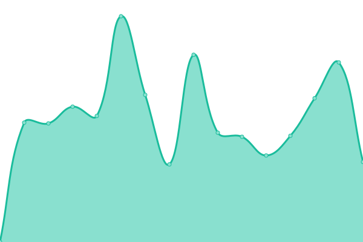
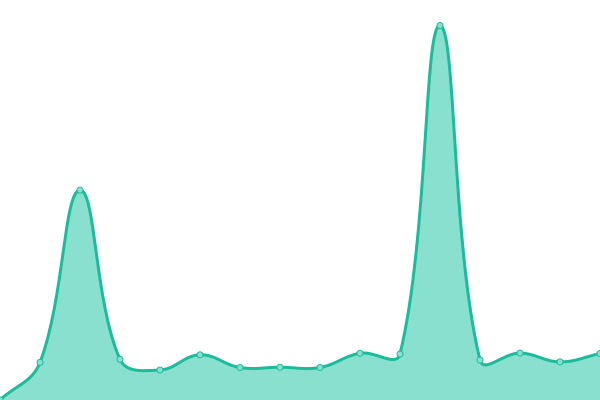

# [📈 Live Status](https://upptime.24heures.org): <!--live status--> **🟩 All systems operational**

This repository contains the open-source uptime monitor and status page for [24 heures de l'INSA](https://www.24heures.org), powered by [Upptime](https://github.com/upptime/upptime).

With [Upptime](https://upptime.js.org), you can get your own unlimited and free uptime monitor and status page, powered entirely by a GitHub repository. We use [Issues](https://github.com/24HeuresINSA/upptime/issues) as incident reports, [Actions](https://github.com/24HeuresINSA/upptime/actions) as uptime monitors, and [Pages](https://upptime.24heures.org) for the status page.

<!--start: status pages-->
<!-- This summary is generated by Upptime (https://github.com/upptime/upptime) -->
<!-- Do not edit this manually, your changes will be overwritten -->
<!-- prettier-ignore -->
| URL | Status | History | Response Time | Uptime |
| --- | ------ | ------- | ------------- | ------ |
|  [Google](https://www.google.com) | 🟩 Up | [google.yml](https://github.com/24HeuresINSA/upptime/commits/HEAD/history/google.yml) | 

 154ms
     
 | 

<a href="https://upptime.24heures.org/history/google">100.00%</a>
    

|  [Website](https://www.24heures.org) | 🟩 Up | [website.yml](https://github.com/24HeuresINSA/upptime/commits/HEAD/history/website.yml) | 

 2664ms
     
 | 

<a href="https://upptime.24heures.org/history/website">93.33%</a>
    

|  [Overbookd frontend](https://overbookd.24heures.org) | 🟩 Up | [overbookd-frontend.yml](https://github.com/24HeuresINSA/upptime/commits/HEAD/history/overbookd-frontend.yml) | 

 838ms
     
 | 

<a href="https://upptime.24heures.org/history/overbookd-frontend">93.34%</a>
    

|  [Overbookd backend](https://overbookd.24heures.org/api/config) | 🟩 Up | [overbookd-backend.yml](https://github.com/24HeuresINSA/upptime/commits/HEAD/history/overbookd-backend.yml) | 

 306ms
     
 | 

<a href="https://upptime.24heures.org/history/overbookd-backend">93.35%</a>
    

|  [Preprod Overbookd frontend](https://preprod.overbookd.24heures.org) | 🟩 Up | [preprod-overbookd-frontend.yml](https://github.com/24HeuresINSA/upptime/commits/HEAD/history/preprod-overbookd-frontend.yml) | 

 783ms
     
 | 

<a href="https://upptime.24heures.org/history/preprod-overbookd-frontend">93.36%</a>
    

|  [Preprod Overbookd backend](https://preprod.overbookd.24heures.org/api/config) | 🟩 Up | [preprod-overbookd-backend.yml](https://github.com/24HeuresINSA/upptime/commits/HEAD/history/preprod-overbookd-backend.yml) | 

 634ms
     
 | 

<a href="https://upptime.24heures.org/history/preprod-overbookd-backend">93.37%</a>
    

|  [Courses Website](https://courses.24heures.org) | 🟩 Up | [courses-website.yml](https://github.com/24HeuresINSA/upptime/commits/HEAD/history/courses-website.yml) | 

 1340ms
     
 | 

<a href="https://upptime.24heures.org/history/courses-website">93.78%</a>
    

|  [Courses24maker](https://courses24maker.24heures.org) | 🟩 Up | [courses24maker.yml](https://github.com/24HeuresINSA/upptime/commits/HEAD/history/courses24maker.yml) | 

 913ms
     
 | 

<a href="https://upptime.24heures.org/history/courses24maker">93.39%</a>
    

|  [Assomaker](https://assomaker.24heures.org) | 🟩 Up | [assomaker.yml](https://github.com/24HeuresINSA/upptime/commits/HEAD/history/assomaker.yml) | 

 1085ms
     
 | 

<a href="https://upptime.24heures.org/history/assomaker">93.80%</a>
    

<!--end: status pages-->

[**Visit our status website →**](https://upptime.24heures.org)

## 📄 License

- Powered by: [Upptime](https://github.com/upptime/upptime)
- Code: [MIT](./LICENSE) © [24 heures de l'INSA](https://www.24heures.org)
- Data in the `./history` directory: [Open Database License](https://opendatacommons.org/licenses/odbl/1-0/)
