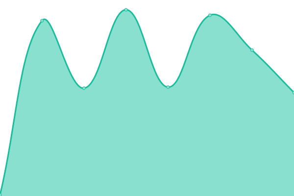

# [📈 Live Status](https://upptime.24heures.org): <!--live status--> **🟩 All systems operational**

This repository contains the open-source uptime monitor and status page for [24 heures de l'INSA](https://www.24heures.org), powered by [Upptime](https://github.com/upptime/upptime).

With [Upptime](https://upptime.js.org), you can get your own unlimited and free uptime monitor and status page, powered entirely by a GitHub repository. We use [Issues](https://github.com/24HeuresINSA/upptime/issues) as incident reports, [Actions](https://github.com/24HeuresINSA/upptime/actions) as uptime monitors, and [Pages](https://upptime.24heures.org) for the status page.

<!--start: status pages-->
<!-- This summary is generated by Upptime (https://github.com/upptime/upptime) -->
<!-- Do not edit this manually, your changes will be overwritten -->
<!-- prettier-ignore -->
| URL | Status | History | Response Time | Uptime |
| --- | ------ | ------- | ------------- | ------ |
|  [Google](https://www.google.com) | 🟩 Up | [google.yml](https://github.com/24HeuresINSA/upptime/commits/HEAD/history/google.yml) | 

 90ms
     
 | 

<a href="https://upptime.24heures.org/history/google">100.00%</a>
    

|  [Website](https://www.24heures.org) | 🟩 Up | [website.yml](https://github.com/24HeuresINSA/upptime/commits/HEAD/history/website.yml) | 

 1599ms
     
 | 

<a href="https://upptime.24heures.org/history/website">100.00%</a>
    

|  [Overbookd frontend](https://overbookd.24heures.org) | 🟩 Up | [overbookd-frontend.yml](https://github.com/24HeuresINSA/upptime/commits/HEAD/history/overbookd-frontend.yml) | 

 653ms
     
 | 

<a href="https://upptime.24heures.org/history/overbookd-frontend">100.00%</a>
    

|  [Overbookd backend](https://overbookd.24heures.org/api/) | 🟩 Up | [overbookd-backend.yml](https://github.com/24HeuresINSA/upptime/commits/HEAD/history/overbookd-backend.yml) | 

 97ms
     
 | 

<a href="https://upptime.24heures.org/history/overbookd-backend">100.00%</a>
    

|  [Preprod Overbookd frontend](https://preprod.overbookd.24heures.org) | 🟩 Up | [preprod-overbookd-frontend.yml](https://github.com/24HeuresINSA/upptime/commits/HEAD/history/preprod-overbookd-frontend.yml) | 

 691ms
     
 | 

<a href="https://upptime.24heures.org/history/preprod-overbookd-frontend">100.00%</a>
    

|  [Preprod Overbookd backend](https://preprod.overbookd.24heures.org/api/) | 🟩 Up | [preprod-overbookd-backend.yml](https://github.com/24HeuresINSA/upptime/commits/HEAD/history/preprod-overbookd-backend.yml) | 

 110ms
     
 | 

<a href="https://upptime.24heures.org/history/preprod-overbookd-backend">98.69%</a>
    

|  [cetait mieux avant Overbookd frontend](https://cetaitmieuxavant.24heures.org) | 🟩 Up | [cetait-mieux-avant-overbookd-frontend.yml](https://github.com/24HeuresINSA/upptime/commits/HEAD/history/cetait-mieux-avant-overbookd-frontend.yml) | 

 660ms
     
 | 

<a href="https://upptime.24heures.org/history/cetait-mieux-avant-overbookd-frontend">100.00%</a>
    

|  [cetait mieux avant Overbookd backend](https://cetaitmieuxavant.24heures.org/api/) | 🟩 Up | [cetait-mieux-avant-overbookd-backend.yml](https://github.com/24HeuresINSA/upptime/commits/HEAD/history/cetait-mieux-avant-overbookd-backend.yml) | 

 97ms
     
 | 

<a href="https://upptime.24heures.org/history/cetait-mieux-avant-overbookd-backend">100.00%</a>
    

|  [OverRun backend](https://overrun.24heures.org/api/v1) | 🟩 Up | [over-run-backend.yml](https://github.com/24HeuresINSA/upptime/commits/HEAD/history/over-run-backend.yml) | 

 591ms
     
 | 

<a href="https://upptime.24heures.org/history/over-run-backend">100.00%</a>
    

|  [OverRun frontend User](https://overrun.24heures.org) | 🟩 Up | [over-run-frontend-user.yml](https://github.com/24HeuresINSA/upptime/commits/HEAD/history/over-run-frontend-user.yml) | 

 99ms
     
 | 

<a href="https://upptime.24heures.org/history/over-run-frontend-user">100.00%</a>
    

|  [OverRun frontend Admin](https://overrun.24heures.org/admin) | 🟩 Up | [over-run-frontend-admin.yml](https://github.com/24HeuresINSA/upptime/commits/HEAD/history/over-run-frontend-admin.yml) | 

 100ms
     
 | 

<a href="https://upptime.24heures.org/history/over-run-frontend-admin">100.00%</a>
    

<!--end: status pages-->

[**Visit our status website →**](https://upptime.24heures.org)

## 📄 License

- Powered by: [Upptime](https://github.com/upptime/upptime)
- Code: [MIT](./LICENSE) © [24 heures de l'INSA](https://www.24heures.org)
- Data in the `./history` directory: [Open Database License](https://opendatacommons.org/licenses/odbl/1-0/)
