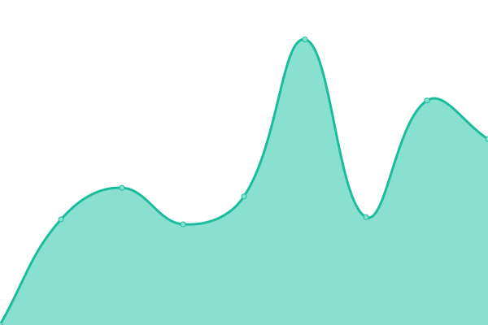
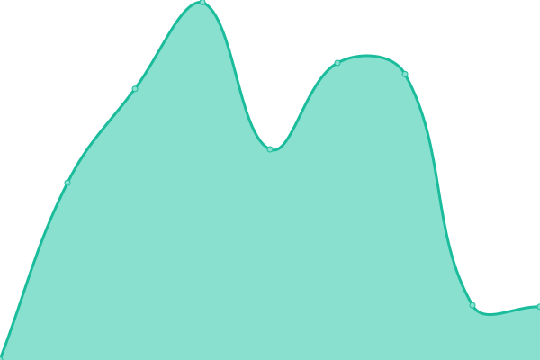

# [📈 Live Status](https://upptime.24heures.org): <!--live status--> **🟩 All systems operational**

This repository contains the open-source uptime monitor and status page for [24 heures de l'INSA](https://www.24heures.org), powered by [Upptime](https://github.com/upptime/upptime).

With [Upptime](https://upptime.js.org), you can get your own unlimited and free uptime monitor and status page, powered entirely by a GitHub repository. We use [Issues](https://github.com/24HeuresINSA/upptime/issues) as incident reports, [Actions](https://github.com/24HeuresINSA/upptime/actions) as uptime monitors, and [Pages](https://upptime.24heures.org) for the status page.

<!--start: status pages-->
<!-- This summary is generated by Upptime (https://github.com/upptime/upptime) -->
<!-- Do not edit this manually, your changes will be overwritten -->
<!-- prettier-ignore -->
| URL | Status | History | Response Time | Uptime |
| --- | ------ | ------- | ------------- | ------ |
|  [Google](https://www.google.com) | 🟩 Up | [google.yml](https://github.com/24HeuresINSA/upptime/commits/HEAD/history/google.yml) | 

 85ms
     
 | 

<a href="https://upptime.24heures.org/history/google">100.00%</a>
    

|  [Website](https://www.24heures.org) | 🟩 Up | [website.yml](https://github.com/24HeuresINSA/upptime/commits/HEAD/history/website.yml) | 

 980ms
     
 | 

<a href="https://upptime.24heures.org/history/website">100.00%</a>
    

|  [Strapi](https://strapi.24heures.org) | 🟩 Up | [strapi.yml](https://github.com/24HeuresINSA/upptime/commits/HEAD/history/strapi.yml) | 

 923ms
     
 | 

<a href="https://upptime.24heures.org/history/strapi">100.00%</a>
    

|  [Website - from globalping (california)](https://www.24heures.org) | 🟩 Up | [website-from-globalping-california.yml](https://github.com/24HeuresINSA/upptime/commits/HEAD/history/website-from-globalping-california.yml) | 

 765ms
     
 | 

<a href="https://upptime.24heures.org/history/website-from-globalping-california">100.00%</a>
    

|  [Website - from globalping (berlin)](https://www.24heures.org) | 🟩 Up | [website-from-globalping-berlin.yml](https://github.com/24HeuresINSA/upptime/commits/HEAD/history/website-from-globalping-berlin.yml) | 

 152ms
     
 | 

<a href="https://upptime.24heures.org/history/website-from-globalping-berlin">100.00%</a>
    

|  [Website - from globalping (paris)](https://www.24heures.org) | 🟩 Up | [website-from-globalping-paris.yml](https://github.com/24HeuresINSA/upptime/commits/HEAD/history/website-from-globalping-paris.yml) | 

 103ms
     
 | 

<a href="https://upptime.24heures.org/history/website-from-globalping-paris">100.00%</a>
    

|  [Overbookd frontend](https://overbookd.24heures.org) | 🟩 Up | [overbookd-frontend.yml](https://github.com/24HeuresINSA/upptime/commits/HEAD/history/overbookd-frontend.yml) | 

 750ms
     
 | 

<a href="https://upptime.24heures.org/history/overbookd-frontend">100.00%</a>
    

|  [Overbookd backend](https://overbookd.24heures.org/api/) | 🟩 Up | [overbookd-backend.yml](https://github.com/24HeuresINSA/upptime/commits/HEAD/history/overbookd-backend.yml) | 

 130ms
     
 | 

<a href="https://upptime.24heures.org/history/overbookd-backend">100.00%</a>
    

|  [Preprod Overbookd frontend](https://preprod.overbookd.24heures.org) | 🟩 Up | [preprod-overbookd-frontend.yml](https://github.com/24HeuresINSA/upptime/commits/HEAD/history/preprod-overbookd-frontend.yml) | 

 644ms
     
 | 

<a href="https://upptime.24heures.org/history/preprod-overbookd-frontend">100.00%</a>
    

|  [Preprod Overbookd backend](https://preprod.overbookd.24heures.org/api/) | 🟩 Up | [preprod-overbookd-backend.yml](https://github.com/24HeuresINSA/upptime/commits/HEAD/history/preprod-overbookd-backend.yml) | 

 130ms
     
 | 

<a href="https://upptime.24heures.org/history/preprod-overbookd-backend">100.00%</a>
    

|  [cetait mieux avant Overbookd frontend](https://cetaitmieuxavant.24heures.org) | 🟩 Up | [cetait-mieux-avant-overbookd-frontend.yml](https://github.com/24HeuresINSA/upptime/commits/HEAD/history/cetait-mieux-avant-overbookd-frontend.yml) | 

 638ms
     
 | 

<a href="https://upptime.24heures.org/history/cetait-mieux-avant-overbookd-frontend">100.00%</a>
    

|  [cetait mieux avant Overbookd backend](https://cetaitmieuxavant.24heures.org/api/) | 🟩 Up | [cetait-mieux-avant-overbookd-backend.yml](https://github.com/24HeuresINSA/upptime/commits/HEAD/history/cetait-mieux-avant-overbookd-backend.yml) | 

 192ms
     
 | 

<a href="https://upptime.24heures.org/history/cetait-mieux-avant-overbookd-backend">100.00%</a>
    

|  [OverRun frontend](https://overrun.24heures.org) | 🟩 Up | [over-run-frontend.yml](https://github.com/24HeuresINSA/upptime/commits/HEAD/history/over-run-frontend.yml) | 

 740ms
     
 | 

<a href="https://upptime.24heures.org/history/over-run-frontend">100.00%</a>
    

|  [OverRun backend](https://overrun.24heures.org/rest-api/) | 🟩 Up | [over-run-backend.yml](https://github.com/24HeuresINSA/upptime/commits/HEAD/history/over-run-backend.yml) | 

 129ms
     
 | 

<a href="https://upptime.24heures.org/history/over-run-backend">100.00%</a>
    

|  [Preprod OverRun frontend](https://preprod.overrun.24heures.org) | 🟩 Up | [preprod-over-run-frontend.yml](https://github.com/24HeuresINSA/upptime/commits/HEAD/history/preprod-over-run-frontend.yml) | 

 685ms
     
 | 

<a href="https://upptime.24heures.org/history/preprod-over-run-frontend">100.00%</a>
    

|  [Preprod OverRun backend](https://preprod.overrun.24heures.org/rest-api/) | 🟩 Up | [preprod-over-run-backend.yml](https://github.com/24HeuresINSA/upptime/commits/HEAD/history/preprod-over-run-backend.yml) | 

 128ms
     
 | 

<a href="https://upptime.24heures.org/history/preprod-over-run-backend">100.00%</a>
    

|  [OverSales frontend](https://oversales.24heures.org) | 🟩 Up | [over-sales-frontend.yml](https://github.com/24HeuresINSA/upptime/commits/HEAD/history/over-sales-frontend.yml) | 

 614ms
     
 | 

<a href="https://upptime.24heures.org/history/over-sales-frontend">100.00%</a>
    

|  [OverSales backend](https://oversales.24heures.org/api) | 🟩 Up | [over-sales-backend.yml](https://github.com/24HeuresINSA/upptime/commits/HEAD/history/over-sales-backend.yml) | 

 130ms
     
 | 

<a href="https://upptime.24heures.org/history/over-sales-backend">100.00%</a>
    

|  [Grafana](https://gestion.24heures.org/grafana/healthz) | 🟩 Up | [grafana.yml](https://github.com/24HeuresINSA/upptime/commits/HEAD/history/grafana.yml) | 

 553ms
     
 | 

<a href="https://upptime.24heures.org/history/grafana">100.00%</a>
    

|  [Wiki](https://wiki.24heures.org/MediaWiki:Connexion_n%C3%A9cessaire) | 🟩 Up | [wiki.yml](https://github.com/24HeuresINSA/upptime/commits/HEAD/history/wiki.yml) | 

 795ms
     
 | 

<a href="https://upptime.24heures.org/history/wiki">100.00%</a>
    

|  [Zitadel](https://zitadel.24heures.org/debug/healthz) | 🟩 Up | [zitadel.yml](https://github.com/24HeuresINSA/upptime/commits/HEAD/history/zitadel.yml) | 

 627ms
     
 | 

<a href="https://upptime.24heures.org/history/zitadel">100.00%</a>
    

<!--end: status pages-->

[**Visit our status website →**](https://upptime.24heures.org)

## 📄 License

- Powered by: [Upptime](https://github.com/upptime/upptime)
- Code: [MIT](./LICENSE) © [24 heures de l'INSA](https://www.24heures.org)
- Data in the `./history` directory: [Open Database License](https://opendatacommons.org/licenses/odbl/1-0/)
